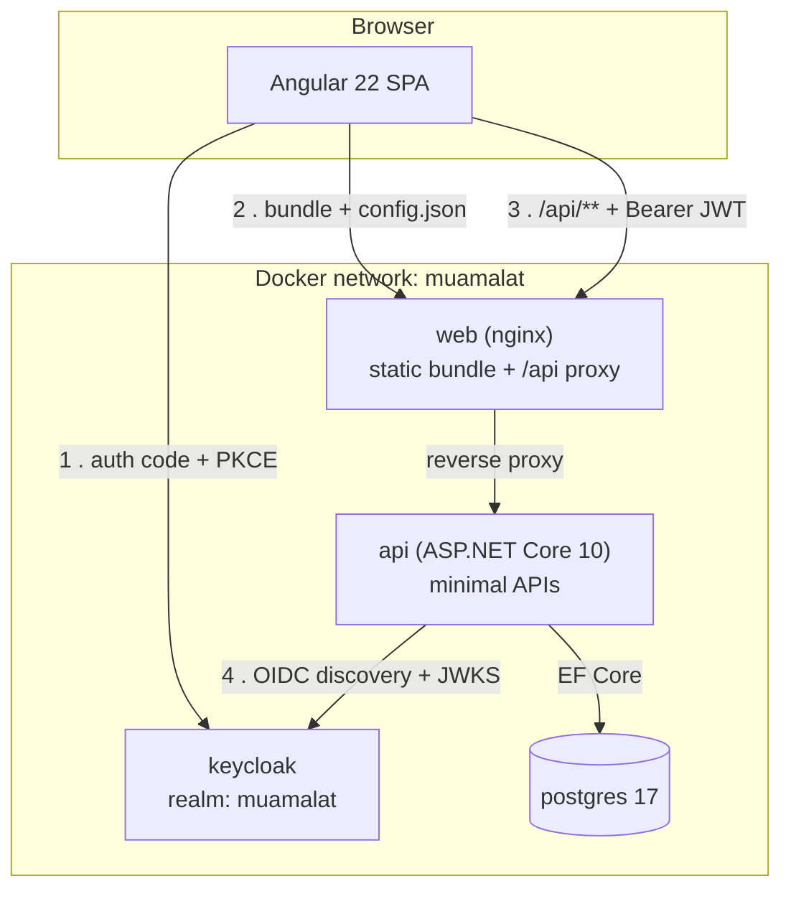
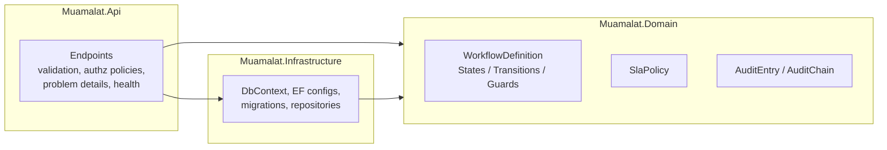
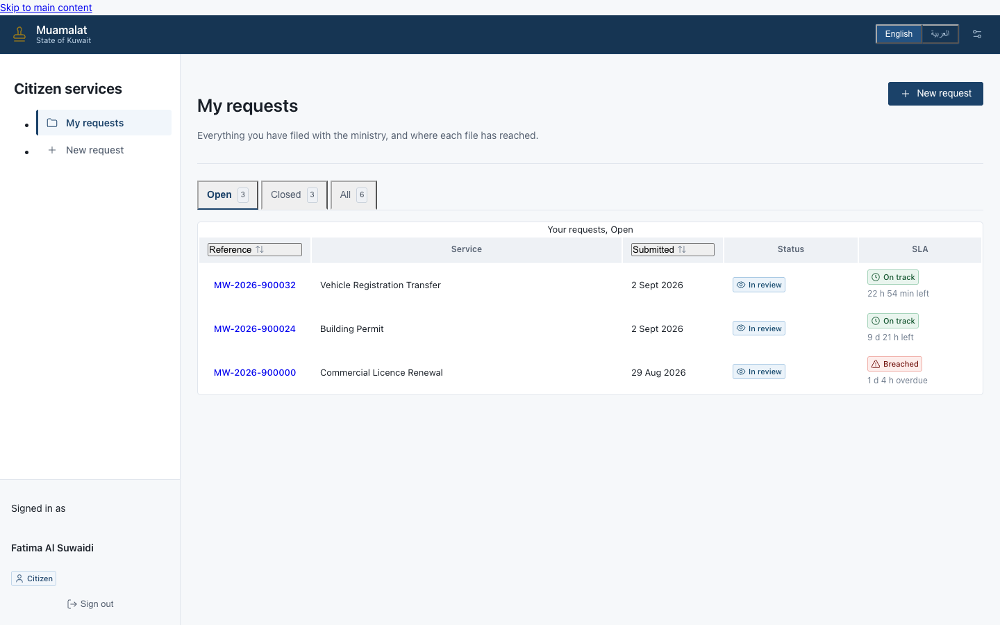
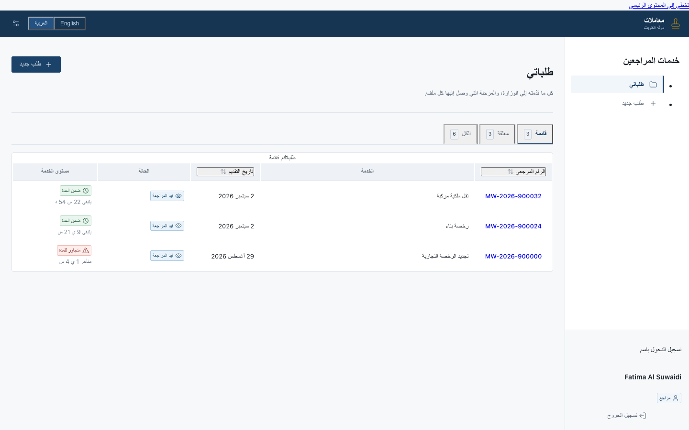
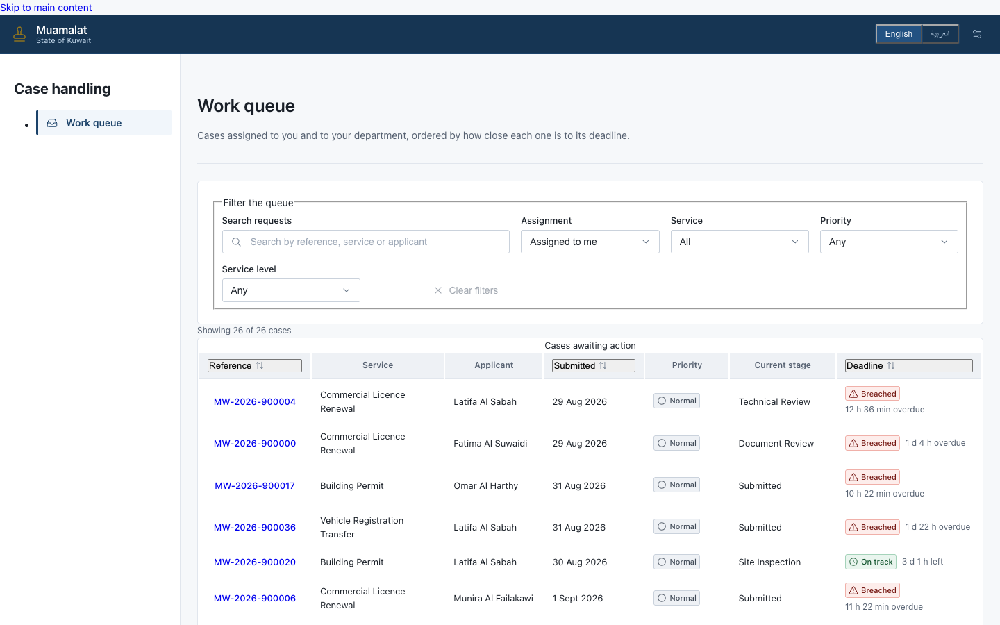
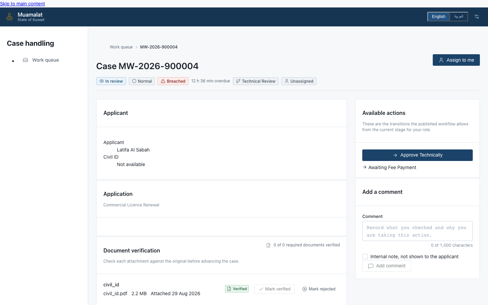
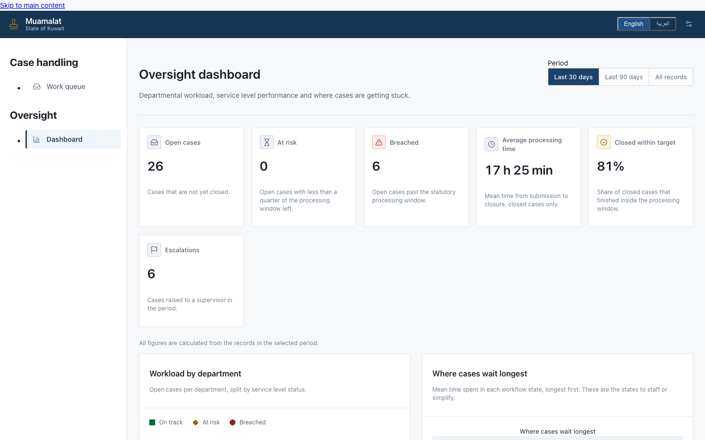
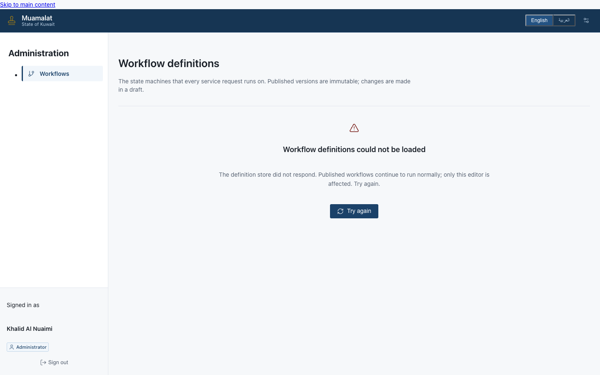
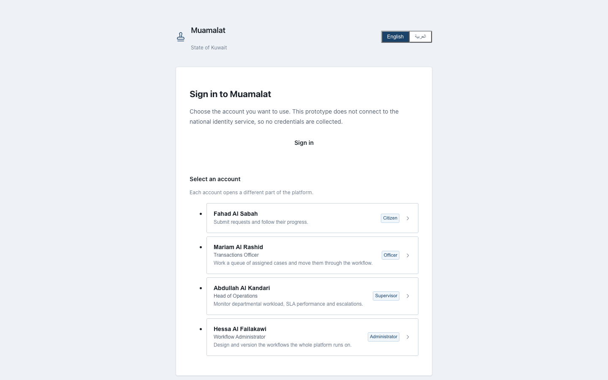
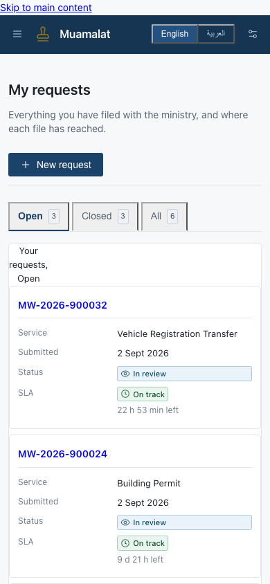

# Muamalat

**An e-government service request and workflow platform.**

*Muamalat* (معاملات) is the Arabic word for transactions or dealings, and it is what people
across the Gulf actually call the paperwork they file with a government department.

A citizen applies for a commercial licence renewal. The application goes to a department,
gets reviewed by an officer, maybe bounces back for a missing document, gets approved by a
supervisor, and a decision is issued. That process is the same shape for a hundred different
services and it is almost always run on email, spreadsheets and a counter queue.

Muamalat replaces that with a system where the procedure itself is configuration, the
citizen can see exactly where their request is, cases that are running late escalate on
their own, and every action is recorded in a hash chain so that a decision can still be
explained two years later.

---

## The problem

| What goes wrong today | What Muamalat does about it |
|---|---|
| A citizen submits a request and has no way to find out where it is. | Every request has a live status, the current stage, who holds it, and a full timeline. |
| Each service has its own procedure, and procedures change by ministerial decision, not by release train. | Workflows are stored as data and edited by administrators. Changing a procedure does not require a developer, a build or a deployment window. |
| Cases sit in a queue and nobody notices until the applicant complains. | Every stage carries an SLA. Requests are flagged at risk before they breach and escalate to a supervisor after. |
| When a decision is challenged, `updated_by` proves nothing, because whoever can change the row can change that column too. | Every action is an entry in a per-request SHA-256 hash chain. Altering history breaks the chain at the exact point it was altered. |
| Changing a workflow silently changes the rules under requests that are already halfway through it. | Definitions are versioned and immutable once published. An in-flight request keeps executing against the version it started on. |

---

## Who uses it

| Role | What they do |
|---|---|
| **Citizen** | Submits requests, uploads supporting documents, responds to requests for information, tracks status. Sees their own requests and nobody else's. |
| **Officer** | Works their department's queue: reviews submissions, verifies documents, asks for more information, executes the transitions their role permits. |
| **Supervisor** | Everything an Officer can do, plus approve, reject, reassign and escalate. Sees the whole department queue and the SLA board. |
| **Admin** | Configures services, departments, SLA policies and workflow definitions. Deliberately cannot approve requests: see [separation of duties](docs/ARCHITECTURE.md#roles). |

---

## Features

**Service requests**
* Bilingual service catalogue (Arabic and English) with per-service form schemas and required document types
* Request submission with document upload, request reference numbers, and a citizen-facing progress timeline
* Request-for-information loop that returns a case to the applicant and back to the state that asked

**Workflow engine**
* Workflow definitions stored as data: states, transitions, allowed roles, guards and actions are rows, not `switch` statements
* Versioned and immutable once published, so in-flight requests never change procedure underneath themselves
* Publish-time structural validation: rejects dead ends, unreachable states, missing start or terminal states, and transitions no role can execute
* Composable guards including required document types, document verification, fee payment, mandatory comments, and segregation of duties (the officer who reviewed cannot be the supervisor who approves)

**SLA and escalation**
* Per-state SLA target with a configurable at-risk warning threshold (defaults to 75% of target)
* On-track, at-risk and breached status computed per request
* Escalation to a nominated role on breach

**Audit**
* Per-request SHA-256 hash chain: each entry hashes its own content plus the previous entry's hash
* Chain verification distinguishes content alteration, broken links, sequence gaps and foreign entries, and reports the exact sequence number at fault
* Actor, roles held at the time, and structured payload recorded for every event

**Platform**
* Keycloak OIDC with authorization code plus PKCE, four realm roles, and a committed, reviewable realm export
* Whole stack runs from one `docker compose up` with healthcheck-ordered startup and no sleep-based waiting
* Both container images run as non-root, and CI asserts it

---

## Technology

| Layer | Choice |
|---|---|
| Backend | .NET 10, ASP.NET Core minimal APIs, C# |
| Domain | Pure C#, no framework dependencies |
| Persistence | EF Core 10, Npgsql, PostgreSQL 17 |
| Validation | FluentValidation |
| Logging | Serilog (structured) |
| Frontend | Angular 22, standalone components, signals, zoneless change detection, SCSS |
| Identity | Keycloak 26 (OIDC, PKCE) |
| Web tier | nginx (static bundle plus reverse proxy) |
| Tests | xUnit, FluentAssertions, Testcontainers, Karma and Jasmine under ChromeHeadless |
| CI | GitHub Actions |
| Local stack | Docker Compose |

---

## Architecture



Inside the API:



Dependencies point inward only. `Muamalat.Domain` references no framework, which is what
makes workflow validation, guard evaluation, SLA arithmetic and audit chain verification
testable in milliseconds without a container.

The full engineering rationale, including the parts that are wrong on purpose, is in
**[docs/ARCHITECTURE.md](docs/ARCHITECTURE.md)**.

---

## Quick start

Requires Docker with Compose v2. Nothing else: no local .NET SDK, no Node, no PostgreSQL.

```bash
git clone <this-repo> muamalat && cd muamalat

cp infra/.env.example infra/.env

docker compose -f infra/docker-compose.yml up --build
```

First run takes a few minutes (it pulls the .NET SDK image and runs `npm ci`). When it
settles, open **http://localhost:4200** and sign in with any account from the table below.

Startup is ordered by healthchecks, so the services come up in dependency order on their
own. There is no sleep and no wait-for-it script anywhere in this repository.

```bash
docker compose -f infra/docker-compose.yml ps          # watch health status
docker compose -f infra/docker-compose.yml logs -f api # follow one service
docker compose -f infra/docker-compose.yml down        # stop, keep the database
docker compose -f infra/docker-compose.yml down -v     # stop and wipe the database
```

**If a port is already taken**, change it in `infra/.env` (each port is a variable) rather
than editing the compose file. Only the host side of each mapping moves; nothing inside the
network depends on it.

---

## Ports

| Service | URL | Host port | Container port | Notes |
|---|---|---|---|---|
| **web** | http://localhost:4200 | `WEB_PORT` (4200) | 8080 | Angular SPA. Also proxies `/api`, `/health`, `/openapi` to the API. |
| **api** | http://localhost:8080 | `API_PORT` (8080) | 8080 | Exposed for direct calls and OpenAPI. The SPA does not use this port. |
| **keycloak** | http://localhost:8081 | `KEYCLOAK_PORT` (8081) | 8080 | Admin console at `/admin`. |
| **postgres** | localhost:5432 | `POSTGRES_PORT` (5432) | 5432 | Exposed only so you can attach `psql` or a GUI client. |

Keycloak's management interface (health and metrics) listens on container port 9000 and is
not published to the host. The healthcheck reaches it from inside the container.

---

## Demo credentials

Created by the realm import at `infra/keycloak/realm-muamalat.json`. All six accounts were
verified against a running Keycloak 26.4: each signs in, and each receives a token carrying
the expected roles and the `muamalat-api` audience.

| Username | Name | Role | Password |
|---|---|---|---|
| `fatima.alsuwaidi` | Fatima Al Suwaidi | Citizen | `Citizen#2026` |
| `omar.alharthy` | Omar Al Harthy | Citizen | `Citizen#2026` |
| `noura.alkaabi` | Noura Al Kaabi | Officer | `Officer#2026` |
| `yousef.almazrouei` | Yousef Al Mazrouei | Officer | `Officer#2026` |
| `mariam.albalushi` | Mariam Al Balushi | Supervisor | `Supervisor#2026` |
| `khalid.alnuaimi` | Khalid Al Nuaimi | Admin | `Admin#2026!` |

Keycloak admin console: **http://localhost:8081/admin**, user `admin`, password `admin`
(both from `infra/.env`).

`Supervisor` is a composite role and therefore also carries `Officer`; Mariam's token
contains both. `Admin` is deliberately not composite of `Supervisor`, so Khalid can
configure workflows but cannot approve requests running through them.

These are development credentials in an ephemeral realm and they are published on purpose.
See [Security notes](#security-notes).

### Getting a token from the command line

Useful for poking the API with `curl` without a browser:

```bash
curl -s -X POST \
  http://localhost:8081/realms/muamalat/protocol/openid-connect/token \
  -d client_id=muamalat-web \
  -d grant_type=password \
  -d username=noura.alkaabi \
  --data-urlencode 'password=Officer#2026' | jq -r .access_token
```

This works because the realm enables the password grant **for development only**. Turn it
off before this goes anywhere near a network.

---

## API documentation

The API publishes an OpenAPI document via `Microsoft.AspNetCore.OpenApi`.

| What | Where |
|---|---|
| OpenAPI JSON | http://localhost:8080/openapi/v1.json |
| Through the web tier | http://localhost:4200/openapi/v1.json |
| Readiness probe | http://localhost:8080/health/ready |
| Liveness probe | http://localhost:8080/health/live |
| Keycloak OIDC discovery | http://localhost:8081/realms/muamalat/.well-known/openid-configuration |

The OpenAPI document is served in the `Development` environment only, which is the default
in `infra/.env.example`.

---

## Running the tests

Everything below also runs in CI on every push and pull request
(`.github/workflows/ci.yml`). Nothing there is marked `continue-on-error`.

**Backend** (needs the .NET 10 SDK; the integration tests need a running Docker daemon
because they use Testcontainers to start a real PostgreSQL):

```bash
dotnet restore backend/Muamalat.slnx
dotnet build   backend/Muamalat.slnx --configuration Release -warnaserror
dotnet test    backend/Muamalat.slnx --configuration Release
```

**Frontend** (needs Node **24.15.0 or newer**; Angular 22 refuses to build on anything
older and says so clearly. The `node:24-alpine` image used by `infra/Dockerfile.web` is
currently 24.20.0, so the container build is unaffected by a stale local Node):

```bash
cd frontend
node --version          # must be >= v24.15.0
npm ci
npm run build
npm test -- --watch=false --browsers=ChromeHeadless
```

**Infrastructure** (needs only Docker and Python):

```bash
cp infra/.env.example infra/.env
docker compose -f infra/docker-compose.yml config --quiet   # compose parses, vars resolve
python3 -m json.tool infra/keycloak/realm-muamalat.json     # realm export is valid JSON
shellcheck infra/web-entrypoint.sh
```

CI additionally builds both container images, asserts neither runs as root, then starts the
web image and checks that `/healthz` answers, that a deep link falls back to `index.html`,
and that the security headers are actually present on the response.

---

## Screenshots

Every image below was captured from the running stack: a real Keycloak sign in, real
requests moved by the workflow engine, and a database seeded through that same engine so
the audit chains genuinely verify. Nothing here is mocked.

### Citizen

Requests the applicant has filed, with the live service level position of each one.



### Arabic, right to left

Not a translated string table: the layout mirrors. Navigation, tables, icons and reading
order all flip, using CSS logical properties rather than direction overrides.



### Officer work queue

Ordered by how close each case is to its deadline, with breach timers.



### Case detail

The actions offered come from the workflow engine, not from the browser. The engine is the
only place the rules are enforced, so a client that derived its own copy would drift the
moment a definition was edited.



### Supervisor oversight

Departmental workload, where cases are getting stuck, and what has breached.

The on time figure is reconstructed from the audit trail rather than counting sweep events.
The sweep only ever inspects open requests, so a case that breached and then closed between
two sweeps leaves no event behind, and counting events silently overstates performance.



### Administrator

Workflow definitions and versions. Definitions are data, so a new government service is
configuration rather than a release.



### Sign in and mobile

| Sign in | Mobile |
| --- | --- |
|  |  |


*No screenshots yet. They will be captured from the running application rather than mocked.*

---

## Known limitations

Stated plainly, because a portfolio project that claims to be production-ready is telling
you something about its author.

**Audit**
* The hash chain is tamper **evident**, not tamper **proof**. A database trigger makes
  `audit_entries` append-only for every client, but a superuser can disable that trigger,
  rewrite the whole chain from the modified entry forward, recompute every subsequent hash,
  and end up with a perfectly consistent false history that verification will pass. Closing
  that gap needs an anchor outside the database (an off-box digest, signing, or a notary),
  and there is none. Discussed honestly in
  [ARCHITECTURE.md section 5](docs/ARCHITECTURE.md#5-the-hash-chained-audit-trail).
* The append-only trigger is `FOR EACH ROW` on `DELETE OR UPDATE`, so `TRUNCATE` is not
  covered (TRUNCATE does not fire row-level triggers). It stops history being edited, not
  erased wholesale. A `BEFORE TRUNCATE ... FOR EACH STATEMENT` trigger would close that.
* Chains are per request. Deleting an entire request, chain included, is not detectable from
  within the audit table.
* `OccurredAt` is application time. A compromised host can lie about it.
* The canonical hash input is effectively a stored format. Changing field order or JSON
  serialisation breaks every historical hash. There is no version discriminator on entries
  yet to allow that to change safely.

**Workflow**
* Single-token state machine. No parallel branches, no forks and joins, no sub-workflows,
  no timer-driven transitions other than SLA escalation. A service that genuinely needs
  concurrent review is the wrong fit for this engine.
* Guards are a closed set of parameterised kinds. Administrators compose them; adding a new
  kind is a code change. That is the intended trade, not an omission.
* Migrating in-flight requests onto a newer definition version is a deliberate administrative
  action, not automatic. Several versions can be live at once.

**Platform**
* EF Core migrations are applied at API startup. That breaks with more than one API replica,
  because instances race on the migration history table. Scaling out needs a separate
  migration job.
* No distributed tracing, no metrics scraping, no alerting, no log aggregation.
* No rate limiting and no WAF rules. Nothing throttles an authenticated caller.
* Documents are handled through the application rather than presigned URLs to object
  storage, and they are not virus scanned.
* No payment gateway, no notification delivery (email and SMS actions are recorded, not
  sent), no national eID federation.
* There is a named PostgreSQL volume and no documented restore drill, which means there is
  no backup.
* The Content-Security-Policy allows `style-src 'unsafe-inline'` because the Angular
  compiler emits component styles inline. Removing it requires nonce-based CSP
  (`ngCspNonce`) threaded through nginx per request.
* Single tenant: one realm, one database, one ministry.

---

## Security notes

**The committed configuration is a development configuration.** These are the settings that
must change before this stack faces a network, listed so they are not mistaken for
production defaults:

| Setting | Where | Why it is like this | What production needs |
|---|---|---|---|
| `directAccessGrantsEnabled: true` | realm export, `muamalat-web` | Lets the stack be smoke-tested with `curl` and CI obtain a token without a browser | **Disable.** The password grant hands the client the user's password, which is what OIDC exists to avoid. |
| `sslRequired: "none"` | realm export | The stack runs over plain HTTP on localhost | `external` or `all`, behind TLS |
| `Keycloak__RequireHttpsMetadata: false` | compose, `api` | Same reason | `true` |
| `KEYCLOAK_ADMIN_PASSWORD=admin` | `infra/.env.example` | Committed placeholder | A real secret from a secret manager, never a file in git |
| `KEYCLOAK_API_CLIENT_SECRET=dev-only-not-a-real-secret` | `infra/.env.example` and the realm export | Committed placeholder, present in two places | Rotate in both, then move out of git |
| Demo user passwords | this README and the realm export | Demo accounts in an ephemeral realm | Delete the demo users |
| `start-dev` | compose, `keycloak` | In-memory H2, no clustering, no TLS | `kc.sh start` with `KC_DB=postgres` and TLS |
| Postgres published on 5432 | compose | Convenience for `psql` | Do not publish it |

**What is already done properly and should stay that way:**

* Authorization code with **PKCE (S256)**, verified enforced: an authorization request
  without `code_challenge_method` is rejected rather than silently downgraded.
* Implicit flow disabled, verified refused.
* Redirect URIs allow-listed, verified: an unregistered `redirect_uri` is refused outright.
* Access tokens live 300 seconds. Audience is validated strictly against `muamalat-api`
  rather than switching audience validation off.
* Brute-force protection on, with a password policy of at least 10 characters including
  upper, lower, digit and special, and not equal to the username.
* Both container images run as **non-root** (`app` uid 1654 for the API, `nginx` uid 101 for
  the web tier). nginx listens on 8080 rather than a privileged port and writes its pid to
  `/tmp`. CI fails the build if either image reverts to root.
* Security headers set at the nginx server level: `Content-Security-Policy`,
  `X-Content-Type-Options`, `X-Frame-Options`, `Referrer-Policy`,
  `Cross-Origin-Opener-Policy`, `Permissions-Policy`. No `location` block uses `add_header`,
  because `add_header` in a nested block silently discards every inherited header. CI
  asserts the headers are present on a real response.
* The API is same-origin behind the nginx proxy, so there is no CORS policy to drift and a
  tighter `connect-src`.
* Authorisation is layered: transport (JWT), endpoint (policy), workflow transition
  (`AllowedRoles` plus guards, including segregation of duties), and row ownership. Roles
  alone are not enough, because a citizen being allowed to read *a* request does not mean
  they may read *yours*.
* `.gitignore` and `.dockerignore` both exclude `.env` files, keys and certificates.
  `infra/.env` is never committed; `infra/.env.example` is the template.

---

## Repository layout

```
backend/                    .NET 10 solution
  Muamalat.slnx
  src/Muamalat.Api/           minimal APIs, auth wiring, health, OpenAPI
  src/Muamalat.Domain/        workflow engine, SLA, audit chain (no framework deps)
  src/Muamalat.Infrastructure/ EF Core, migrations, repositories
  tests/Muamalat.Tests/       xUnit, Testcontainers
frontend/                   Angular 22 SPA
infra/
  docker-compose.yml          the whole stack
  Dockerfile.api              multi-stage .NET build, non-root runtime
  Dockerfile.web             multi-stage Angular build, nginx runtime, non-root
  nginx.conf                  SPA fallback, gzip, security headers, /api proxy (envsubst template)
  web-entrypoint.sh           renders nginx.conf and publishes /config.json at start
  keycloak/realm-muamalat.json  realm, roles, clients, demo users
  .env.example                every variable, documented
docs/ARCHITECTURE.md        why it is built this way
.github/workflows/ci.yml    backend, frontend, images, config validation
```

Both Dockerfiles take the **repository root** as their build context, because the API needs
`backend/` and the web image needs both `frontend/` and `infra/`. Compose does this for you.

---

## Licence

MIT.
