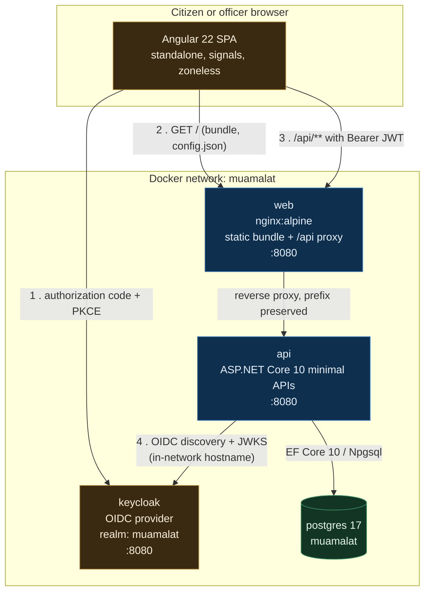

# Muamalat: Architecture

This document explains why the system is built the way it is. It assumes you can read
C# and Docker Compose, so it does not restate what the code already says. It concentrates
on the decisions that were genuinely contested, the constraints that forced them, and the
things that are wrong or missing on purpose.

Contents:

1. [Problem and constraints](#1-problem-and-constraints)
2. [System shape](#2-system-shape)
3. [Domain boundaries](#3-domain-boundaries)
4. [The data-driven workflow engine](#4-the-data-driven-workflow-engine)
5. [The hash-chained audit trail](#5-the-hash-chained-audit-trail)
6. [Authentication and authorisation](#6-authentication-and-authorisation)
7. [Database design](#7-database-design)
8. [Failure handling](#8-failure-handling)
9. [Observability](#9-observability)
10. [Testing strategy](#10-testing-strategy)
11. [Tradeoffs taken](#11-tradeoffs-taken)
12. [Deliberately not built](#12-deliberately-not-built)

---

## 1. Problem and constraints

A government service counter has a small number of recurring problems, and almost none of
them are technical:

* A citizen submits a request and then has no idea where it is. The only status channel is
  phoning someone who also does not know.
* Each service has its own procedure, and procedures change by ministerial decision, not by
  release train. If changing a procedure requires a developer, procedures do not change.
* Cases sit. Nobody notices until the applicant escalates.
* When a decision is challenged, the department needs to prove who did what and when. An
  ordinary `updated_by` column proves nothing, because whoever can change the row can also
  change that column.

Those four problems produce the four load-bearing features: request tracking, a workflow
engine configured as data, SLA timers with escalation, and a tamper-evident audit trail.

Constraints that shaped the design:

* **Bilingual (Arabic and English), right-to-left aware.** This is not a translation layer
  bolted on at the end. Every named domain object carries `NameEn` and `NameAr`, because a
  workflow state whose Arabic name lives in a frontend JSON file will drift from the state
  the engine actually executes.
* **On-premise or sovereign cloud.** No managed workflow service, no serverless
  orchestrator, no dependency on a hyperscaler-only product. Everything here runs from a
  single `docker compose up` on hardware a ministry controls.
* **Auditability is a functional requirement**, not a compliance checkbox added later.
* **One team.** The architecture has to be maintainable by a handful of engineers, which
  rules out microservices for a system with this transaction volume.

---

## 2. System shape

Four containers, one network, one database.



### Why a reverse proxy rather than CORS

The SPA calls the API at `/api/**` on its own origin. nginx forwards it. The alternative,
letting the browser call `http://localhost:8080` directly with CORS headers, works but buys
a permanent preflight round trip on every non-simple request, a CORS policy that has to be
kept in sync with every deployment origin, and a second origin in the CSP.

Proxying makes the API same-origin, which means no preflights, no CORS configuration to
drift, and a tighter `connect-src`. The cost is that nginx is now in the request path and
must be configured correctly, which is why `infra/nginx.conf` is commented rather than
copied from a blog post.

The `/api` prefix is **not** rewritten. `GET /api/v1/requests` arrives at the API as
`/api/v1/requests`. Stripping the prefix is the more common recipe and it is a mistake: the
URL in an nginx access log then differs from the URL in the API log, from the URL in the
OpenAPI document, and from the URL a developer types into curl. One URL, end to end.

### Why the browser talks to Keycloak directly

The identity provider is deliberately **not** proxied. The authorization code flow needs
the browser to reach Keycloak on the same origin Keycloak believes it is serving, and
tunnelling an IdP through your own reverse proxy means owning cookie domains, the
check-session iframe, and logout propagation. It is a well-known source of subtle,
intermittent session bugs. The price is one extra origin in `connect-src` and `frame-src`.

### The issuer versus metadata split

This is the one piece of compose configuration that looks redundant and is not.

Keycloak stamps an `iss` claim into every token. That value must be the URL the **browser**
used (`http://localhost:8081/realms/muamalat`), because that is where the token was minted.
The API container cannot resolve `localhost:8081`; from inside the network Keycloak is
`keycloak:8080`.

The resolution is two Keycloak settings plus one non-obvious consequence:

* `KC_HOSTNAME=http://localhost:8081` pins the public base URL, and therefore the `iss`
  claim on every issued token.
* `KC_HOSTNAME_BACKCHANNEL_DYNAMIC=true` lets a server-to-server caller receive endpoint
  URLs it can actually reach.

Verified against Keycloak 26.4, fetching OIDC discovery from inside the network:

```
$ curl http://keycloak:8080/realms/muamalat/.well-known/openid-configuration
  issuer   : http://localhost:8081/realms/muamalat      <- matches the token's iss
  jwks_uri : http://keycloak:8080/realms/muamalat/...   <- reachable from the API container
```

That combination is what makes a single setting sufficient. The API's
`Authentication:Authority` is the **in-network** URL `http://keycloak:8080/realms/muamalat`,
which looks wrong at first glance and is not, because `Authority` does two jobs and they
resolve differently:

1. **Where to fetch discovery and JWKS.** Taken literally from `Authority`, so it must be
   reachable from the API container. `localhost:8081` would fail.
2. **Which issuer to accept.** `JwtBearerHandler` takes this from the `issuer` field of the
   fetched discovery document, not from the `Authority` string. That field says
   `http://localhost:8081/realms/muamalat`, which is exactly the token's `iss`.

Point the API at the public URL instead and it cannot fetch signing keys. Turn off
backchannel-dynamic and it gets handed a `jwks_uri` it cannot reach. The pairing above is
the only configuration where both halves work, and it is verified end to end: a token minted
through `localhost:8081` is accepted by an API that fetched its keys through `keycloak:8080`.

If a future change breaks that assumption (for example Keycloak reporting the backchannel
host as the issuer), the fallback is to configure `MetadataAddress` separately from
`Authority`, which decouples the two jobs explicitly. It is not needed today.

---

## 3. Domain boundaries

Three backend projects. The dependency arrows only ever point inward.

```
Muamalat.Api  ──▶  Muamalat.Infrastructure  ──▶  Muamalat.Domain
      └──────────────────────────────────────────────┘
```

**`Muamalat.Domain`** holds the rules and depends on nothing. No EF Core, no ASP.NET, no
`DbContext`, no `HttpContext`. `WorkflowDefinition.Validate()`, `TransitionGuard.Check()`,
`SlaPolicy.Evaluate()` and `AuditChain.Verify()` are pure functions over in-memory objects.
That is not architectural purity for its own sake: it is what makes the interesting rules
testable in milliseconds without a container, and it is what stops "just add a quick query
here" from leaking persistence concerns into business logic.

The compromise: the entities carry `private set` properties and private parameterless
constructors so EF Core can materialise them. That is a persistence concession inside the
domain project. The alternative, a separate set of persistence models plus mapping in both
directions, costs more than it returns at this size. `SlaPolicy` has a second private
constructor purely so EF can bind it, and it is commented as such rather than left as a
puzzle.

**`Muamalat.Infrastructure`** owns the `DbContext`, the EF configurations, migrations and
repositories. It is the only project that knows PostgreSQL exists.

**`Muamalat.Api`** owns HTTP: minimal API endpoint groups, request and response contracts,
validation, authentication wiring, problem details, health checks. It maps between wire
contracts and domain objects and holds no business rules.

### Domain concepts

* **Service** is what a citizen applies for (a commercial licence renewal, a building
  permit). It points at a workflow key and holds the fee and required document types.
* **ServiceRequest** is one citizen's application. It carries the applicant, the current
  state code, the pinned workflow definition version, the form payload, documents,
  assignment and SLA timestamps.
* **WorkflowDefinition / WorkflowState / WorkflowTransition** are the procedure, stored as
  data. See the next section.
* **AuditEntry** is one immutable link in a per-request hash chain.
* **Department** owns states and officers. Note that department membership lives in the
  application database keyed by the Keycloak subject, **not** as a Keycloak user attribute.
  Keycloak answers "who is this person and what are they allowed to do in general"; the
  application answers "which queue do they work". Putting the org chart in the IdP means
  every reorganisation becomes an identity migration, and it makes local development
  require an IdP round trip to answer a question the database can answer.

---

## 4. The data-driven workflow engine

### The decision

A workflow is a graph: states, transitions between them, who may take each transition, what
must be true first, and what happens afterwards. The obvious implementation is a `switch`
over an enum and a set of `if` statements. It is also the wrong one, for one reason: in this
domain the graph changes by administrative decision, on a timescale of weeks, and the people
who decide are not the people who deploy. A workflow encoded in C# means a code change, a
review, a release and a deployment window every time a ministry adds a review step.

So the definition is data. `WorkflowDefinition` is a row set. States, transitions, allowed
roles, guards and actions are rows. An administrator composes them; nothing is hardcoded.

### Guards and actions as data, not code

The hard part of "workflow as data" is the conditional logic. Two ways to do it:

1. **An embedded expression language.** Maximum flexibility. You now own a parser, a
   sandbox, an evaluation timeout, and a class of production incidents where somebody's
   expression loops forever or reads a field that no longer exists.
2. **A closed set of parameterised rule kinds.** `GuardKind.RequiresDocumentType` with a
   parameter, `GuardKind.RequiresFeePaid`, `GuardKind.RequiresDifferentActorThan`. Every
   kind is a case in a `switch` that a developer wrote, reviewed and tested.

Option 2 was taken. An administrator can compose guards, not invent them. Adding a genuinely
new kind of precondition is a code change, which is correct: a new precondition is new
behaviour and deserves a test. This trades configurability for the ability to reason about
what the system can do. The escape hatch is that guards are composable and parameterised, so
the combinatorial space is large without being unbounded.

`GuardContext` is a read-only record. Guards return `null` on pass or a machine-readable
failure code such as `guard.missing_document:TRADE_LICENCE` on fail. Machine-readable
because the message a citizen sees has to exist in Arabic and English, and building that
string in the domain layer would put presentation concerns in the wrong project.

### Versioning, and why in-flight requests pin their version

This is the part that people get wrong and only discover in production.

Consider a licence renewal workflow with a technical review step. Two hundred requests are
somewhere inside it. An administrator publishes a new version that removes technical review
and adds a fee-payment step. What happens to the two hundred?

If definitions are mutable, they are now in a state that no longer exists. Their next
transition lookup fails, or worse, silently matches a different transition and moves them
somewhere nonsensical. The audit trail then records a transition that the definition never
contained.

So definitions are immutable once published, and versioned:

* `Key` is stable across versions (`commercial-licence-renewal`).
* `Version` increments. Publishing a change creates version N+1; it never edits version N.
* At most one version of a key is `IsPublished` at a time. New requests bind to the
  published version.
* A `ServiceRequest` stores the **definition id**, not the key. It executes against the
  exact graph it started on until it reaches a terminal state.

The cost is real and worth naming: two hundred requests can be running an old procedure for
weeks after the new one is published. That is a feature in a regulatory context (an
applicant is assessed under the rules in force when they applied) and a nuisance
operationally (support has to reason about several live versions at once). If a change is
urgent and legally retroactive, the migration is explicit: an administrator moves requests
onto the new version deliberately, and the move is itself an audited event. There is no
implicit path, because an implicit path is how you end up unable to explain a decision.

### Validation at publish time

`WorkflowDefinition.Validate()` runs before publication and rejects:

* zero or more than one start state
* no terminal state
* a non-terminal state with no outgoing transition (a dead end, meaning a request that can
  never be closed)
* any state unreachable from the start state
* a transition targeting an undefined state
* a transition with no allowed roles, which nobody could ever execute

Publish time, not runtime. A dead-end state discovered at runtime is a stuck citizen request
and a support ticket. Discovered at publish time it is a validation message in the designer.
This is the single highest-value hundred lines in the domain project.

### What the engine deliberately does not do

No parallel branches, no forks and joins, no sub-workflows, no timer-triggered transitions
other than SLA escalation. The graph is a single-token state machine. Real BPMN engines
support all of it, and every one of those features multiplies the state space that has to be
reasoned about, audited and displayed to a citizen as a progress bar. If a service genuinely
needs concurrent parallel review, this engine is the wrong tool and that should be said out
loud rather than discovered halfway through an implementation.

---

## 5. The hash-chained audit trail

### Structure

Each service request owns its own chain. Each `AuditEntry` stores a dense 1-based
`Sequence`, the event, the actor and their roles at the time, a canonical JSON payload, the
timestamp, `PreviousHash`, and `Hash`.

`Hash` is SHA-256 over a canonical serialisation of the entry's own fields **plus** the
previous entry's hash. The genesis entry uses an all-zero previous hash. Fields are joined
with `U+001F` (unit separator), a character that cannot appear unescaped in JSON or in any
identifier, so that two different field combinations cannot produce the same input string by
concatenation. Getting that wrong is the classic hash-chain bug: `("ab", "c")` and
`("a", "bc")` must not hash identically.

`AuditChain.Verify()` walks the ordered entries and reports four distinct problem kinds:

| Kind | Detects |
|---|---|
| `ContentAltered` | Stored hash does not match a recomputation of the entry |
| `BrokenLink` | `PreviousHash` does not match the preceding entry |
| `SequenceGap` | Sequence is not dense, so an entry was deleted |
| `ForeignEntry` | An entry from a different request is present in this chain |

Reporting these separately matters. "Chain invalid" tells an auditor nothing. "Entry 7 was
modified after it was written, and entries 8 through 14 are still internally consistent"
tells them exactly where to look.

### The canonical form is a stored format

`AuditEntry` computes its hash from a fixed field order and a fixed JSON serialisation.
Changing either, including reordering properties, adding a field to the canonical string, or
changing `JsonSerializerOptions`, breaks every historical hash. Verification of every
existing chain would fail, indistinguishably from actual tampering.

This is a schema, not an implementation detail, and it should be treated with the same care
as a database migration. If the canonical form ever must change, the correct move is a
version discriminator on the entry and a verifier that selects the algorithm by version.
That is not built yet, and it is listed under limitations rather than pretended away.

### The honest limitation: evident, not proof

**This is tamper-evident, not tamper-proof.** The distinction is the whole point and it gets
glossed over constantly.

What the chain gives you: an attacker with `UPDATE` on the audit table cannot change one
historical entry and get away with it. Changing entry 7 changes its hash, which no longer
matches entry 8's `PreviousHash`, and the break is detected at the exact position.

What the chain does not give you: an attacker with `UPDATE` and `DELETE` on the whole table
and the application's hashing code can rewrite the entire chain from the modified entry
forward, recomputing every subsequent hash. The result verifies perfectly. It is a
completely consistent, completely false history, and `AuditChain.Verify()` will say it is
valid, because from the inside it **is** valid.

**One layer of defence is in place.** `001_audit_append_only.sql` installs a trigger on
`audit_entries` that unconditionally raises. Verified installed and enabled on a running
stack:

```
CREATE TRIGGER trg_audit_entries_append_only
  BEFORE DELETE OR UPDATE ON public.audit_entries
  FOR EACH ROW EXECUTE FUNCTION fn_audit_entries_append_only()
```

The application already refuses to modify audit rows, but that is a convention any future
service could bypass with a direct connection, and the trigger turns it into something the
database enforces for every client. Two limits are worth stating precisely rather than
letting "append-only" imply more than it delivers:

* A superuser can `ALTER TABLE ... DISABLE TRIGGER`. That is inherent to putting the control
  in the same database as the data.
* The trigger is `FOR EACH ROW` on `DELETE OR UPDATE`. **`TRUNCATE` is not covered**, because
  TRUNCATE does not fire row-level triggers; blocking it needs a separate
  `BEFORE TRUNCATE ... FOR EACH STATEMENT` trigger. So the trigger stops an attacker editing
  history, and does not stop one erasing it wholesale. Adding the statement-level trigger is
  a two-line change and should be made.

The property that would actually close the gap is an anchor the attacker cannot reach: a
value committed outside the database, before the tampering, that fixes what the chain used
to be. Options, roughly in order of cost, none of which are built:

* **Periodic external digest.** Publish the head hash of every chain, or a Merkle root over
  all of them, to somewhere the application cannot rewrite: an append-only log shipped
  off-box, a signed daily email to an audit committee, a WORM bucket. Any later rewrite
  disagrees with a digest that already left the building. This is the highest-value next
  step and it is cheap.
* **Least-privilege database roles.** Give the application role `INSERT` and `SELECT` on the
  audit table and nothing else, so the trigger is a backstop rather than the only control.
* **Signing.** Sign each head hash with a key held in an HSM the application can use but not
  extract. Now forging history requires the HSM, not just the database.
* **External notary or transparency log.** Anchor the daily root somewhere third parties can
  read. Maximum assurance, maximum operational overhead.

The chain as it stands raises the cost of undetected tampering from "one `UPDATE` statement"
to "become superuser, disable a trigger, rewrite every downstream entry, and be sure nobody
has an older copy". For a portfolio system that is an honest place to stop. Claiming it is
immutable would not be.

Two further caveats worth stating plainly:

* `OccurredAt` is application time. A compromised host can lie about it. The chain proves
  ordering, not wall-clock truth.
* Chains are per request, so nothing links request A's chain to request B's. Deleting an
  entire request, chain and all, is not detectable from within the audit table. Detecting
  that needs a global structure (a Merkle tree over head hashes) or foreign-key enforcement
  from an independently anchored register.

---

## 6. Authentication and authorisation

### Identity is not our problem

Keycloak, not a hand-rolled users table. Password hashing, brute-force lockout, password
reset, TOTP, session management, token revocation and OIDC conformance are all solved
problems with expensive failure modes. Writing them again is how portfolios acquire CVEs.

The realm export lives at `infra/keycloak/realm-muamalat.json` and is committed, so identity
configuration is reviewable in a pull request rather than clicked into an admin console and
forgotten.

### Flow

Authorization code with PKCE (S256), public client, no secret. Refresh tokens are handled by
the OIDC library in the SPA. Implicit flow is disabled. Access token lifetime is 300
seconds; a stolen token is useful for five minutes, and the refresh token carries the
session.

Verified against the running realm:

* an authorization request without `code_challenge_method` is rejected
  (`error=invalid_request`, `Missing parameter: code_challenge_method`), so PKCE is enforced
  rather than merely offered
* an unregistered `redirect_uri` is refused outright
* `response_type=token` is refused with `Implicit flow is disabled for the client`

### Roles

Four realm roles: `Citizen`, `Officer`, `Supervisor`, `Admin`.

`Supervisor` is a **composite** of `Officer`. A supervisor who cannot perform the work they
supervise is an artificial restriction, and artificial restrictions get solved with shared
logins. Verified: a Supervisor's token carries `roles: ["Supervisor", "Officer"]`.

`Admin` is deliberately **not** composite of `Supervisor`. Separation of duties: the person
who authors a workflow definition should not also be able to approve requests flowing
through it. An administrator who needs to approve something should be granted `Supervisor`
explicitly, and that grant is visible in Keycloak's own audit log.

### Getting roles into ASP.NET Core

Keycloak puts realm roles in `realm_access.roles`, which is a nested object. ASP.NET Core's
`RoleClaimType` expects a flat, repeated claim, so `[Authorize(Roles = "Officer")]` does
nothing against a stock Keycloak token, and this is the single most common integration bug
with this pairing.

Two ways out: a claims transformation in the API that flattens `realm_access.roles`, or a
protocol mapper in Keycloak that emits a flat `roles` claim. **Both are in place**, which is
belt and braces rather than an accident:

* The API handles it authoritatively. `KeycloakRoles.Flatten` runs in `OnTokenValidated`,
  parses `realm_access`, and adds each role as a `ClaimTypes.Role` claim. A malformed claim
  yields no roles rather than an exception, so a bad token fails closed as "denied" instead
  of "500".
* The realm additionally emits a flat, multivalued `roles` claim via an
  `oidc-usermodel-realm-role-mapper`. The API does not depend on it. It exists because it
  makes a token self-describing when somebody pastes it into a debugger, and because any
  other consumer of these tokens gets the roles without reimplementing the flattening.

An `oidc-audience-mapper` adds `muamalat-api` to the access token audience. Verified: tokens
issued to `muamalat-web` carry exactly `aud: ["muamalat-api"]`, so the API can validate
audience strictly instead of turning `ValidateAudience` off, which is what people do when
this is not configured.

### Verified end to end

Against the running stack, with tokens minted through `localhost:8081` and an API that
fetched its signing keys through `keycloak:8080`:

| Caller | `GET /api/requests/mine` | `GET /api/requests/queue` | `GET /api/workflows` |
|---|---|---|---|
| anonymous | 401 | | |
| Citizen (Fatima) | 200 | 403 | |
| Officer (Noura) | | 200 | |
| Supervisor (Mariam) | | 200 | |
| Admin (Khalid) | | | 200 |
| tampered token | 401 | | |

The Supervisor row is the composite role working: Mariam holds `Supervisor`, the officer
queue requires `Officer`, and the token carries both.

### Four layers of authorisation

Roles alone are not enough. A citizen may read a request; that does not mean they may read
**your** request.

1. **Transport.** Bearer JWT, validated signature, issuer, audience and lifetime.
2. **Endpoint.** Policy or role requirement on the route. Coarse: is this class of user
   allowed to call this class of endpoint at all.
3. **Workflow transition.** `WorkflowTransition.AllowedRoles` plus `TransitionGuard`s. This
   is where the interesting authorisation lives, and it is data, so it differs per workflow
   version. `GuardKind.RequiresDifferentActorThan` implements segregation of duties inside
   the engine: the officer who reviewed cannot be the supervisor who approves.
4. **Row ownership.** A citizen's queries are filtered to their own subject. An officer's
   are filtered to their department's queue. This is enforced in the data access layer, not
   by remembering to add a `WHERE` clause at each call site, because the one call site that
   forgets is the breach.

### Development-only settings that must not ship

Stated explicitly so they are not mistaken for production configuration:

* `directAccessGrantsEnabled: true` on `muamalat-web`. Resource owner password credentials,
  enabled so the stack can be smoke-tested with `curl` and so CI can obtain a token without
  driving a browser. It hands the client the user's password, which is exactly what OIDC
  exists to avoid. **Disable for any non-local deployment.**
* `sslRequired: "none"` on the realm, and `Keycloak__RequireHttpsMetadata: false` on the
  API. Both exist because this stack runs over plain HTTP on localhost.
* `KC_BOOTSTRAP_ADMIN_PASSWORD=admin` and the client secret `dev-only-not-a-real-secret`
  are committed placeholders and are named as such in `infra/.env.example`.
* `start-dev` runs Keycloak on an in-memory H2 database with no clustering and no TLS.
* Demo user passwords are published in the README. They are demo accounts in an ephemeral
  realm; the moment this stack faces a network, the realm export is a template and not a
  configuration.

---

## 7. Database design

PostgreSQL 17, EF Core 10, Npgsql. One database, one schema.

**Keys are UUIDv7** (`Guid.CreateVersion7()`). Sequential integers leak volume and ordering
(request 4,102 tells you how many requests exist and lets you enumerate your neighbours'),
and random UUIDv4 primary keys fragment B-tree indexes badly under insert load. UUIDv7 is
time-ordered in its high bits, so inserts stay near the right edge of the index while the
value stays unguessable.

**Optimistic concurrency, not locks.** `WorkflowDefinition.RowVersion` is a `uint` mapped to
PostgreSQL's system `xmin` column, so no extra column and no trigger is needed. Two
administrators editing the same definition is rare but not impossible, and a lost update
there silently corrupts a procedure. On service requests the same mechanism prevents two
officers double-transitioning a case: the second `SaveChanges` fails with a concurrency
exception, which the API surfaces as `409 Conflict` rather than swallowing.

**Form payloads are `jsonb`.** Each service defines its own fields, so a relational table per
service is not viable and an entity-attribute-value table is worse. `jsonb` allows GIN
indexing on the fields that are actually searched. The cost is that the database cannot
enforce the shape; validation is FluentValidation in the API against the service's declared
field schema. That is a real weakening of the database as the last line of defence, and it
is the correct trade only because the shape is genuinely per-service and versioned.

**The audit table is append-only in the database, not just in the code.**
`001_audit_append_only.sql` installs a `BEFORE UPDATE OR DELETE` trigger on `audit_entries`
that raises unconditionally. See section 5 for what that does and does not buy.

**Some logic lives in SQL, deliberately.** Three idempotent scripts run alongside the EF
migrations, each for a reason that C# would have handled worse:

* `001_audit_append_only.sql`: the append-only trigger. It has to be in the database,
  because its whole purpose is to bind clients that are not this application.
* `002_sla_sweep.sql`: the SLA breach sweep as a set-based function. The alternative is
  loading every open request into memory, evaluating row by row, and writing back one at a
  time. Idempotency is enforced by a unique constraint on
  `(service_request_id, state_code, entered_state_at, level)` plus `ON CONFLICT DO NOTHING`,
  so an overlapping or retried run raises no duplicate breach.
* `003_reference_numbers.sql`: citizen-facing reference numbers (`MW-2026-000123`) allocated
  through a locked counter row. `MAX(reference) + 1` is a read-then-write race, and an
  in-process counter cannot survive a second API instance. Two citizens submitting at the
  same instant during a renewal deadline is the normal case, not the edge case.

The tradeoff is that this logic is not covered by the domain unit tests and needs the
Testcontainers layer to exercise it. That is the correct place for it, but it does mean the
test that matters most for the SLA sweep is the slow one.

**Indexing.** The queries that matter are: a citizen's own requests by recency; a
department's open queue ordered by SLA due date; requests approaching or past SLA breach
across all departments (the escalation sweep); and one request's audit chain in sequence
order. Those imply composite indexes on `(applicant_subject, created_at desc)`,
`(assigned_department, current_state_code, sla_due_at)`, a partial index on
`sla_due_at where state is non-terminal` so the sweep does not scan closed requests, and a
unique index on `(service_request_id, sequence)` for the audit chain, which doubles as the
constraint that makes sequence gaps meaningful.

**Timestamps are `timestamptz`, always UTC in the database.** Local time is a display
concern. A government system operating across a Gulf time zone with no DST is exactly the
environment where someone stores local time, gets away with it for two years, and then
cannot explain an ordering.

**Migrations are EF Core migrations**, applied at API startup for this deployment shape. That
is convenient and it is a known compromise: startup migration does not work with more than
one API replica (two instances race on the migration history table) and it gives you no
review step between "deploy" and "schema changed". The production answer is a separate
migration job that runs to completion before the new API version starts. Named here because
it is the kind of thing that is fine until the day it is not.

---

## 8. Failure handling

### Startup ordering

Compose orders startup entirely with healthchecks and `depends_on` conditions. There is no
`sleep`, no `wait-for-it.sh`, and no retry loop in application code compensating for a race:

* `postgres` is healthy when `pg_isready -U <user> -d <db>` succeeds. The `-d` matters:
  during `initdb`, PostgreSQL accepts connections before the application database exists, so
  a bare `pg_isready` reports healthy too early and the API starts against a database that
  is not there.
* `keycloak` is healthy when `/health/ready` on the management port returns `UP`. The image
  ships no curl and no wget, so the check uses bash `/dev/tcp` redirection to speak HTTP
  directly. `start_period` is 45 seconds because realm import plus Quarkus augmentation is
  genuinely slow on a cold start.
* `api` waits for both to be healthy, then reports healthy on `/health/ready`.
* `web` waits for the API.

### Liveness versus readiness

`/health/live` must have no dependencies. It answers "is this process alive", and if it
checks the database then a database blip restarts every API container, turning a recoverable
outage into a crash loop at the worst possible moment.

`/health/ready` checks the database and the OIDC metadata endpoint. It answers "should this
instance receive traffic", and the right response to a database outage is to stop receiving
traffic, not to die.

nginx's healthcheck hits its own `/healthz`, answered by nginx itself, for the same reason:
an API outage must not restart the web tier.

### DNS and container restarts

nginx's `proxy_pass` uses a variable plus an explicit `resolver 127.0.0.11`, which defers
name resolution to request time. With a literal hostname, nginx resolves once at config load
and caches forever, so a recreated API container with a new IP receives no traffic until
nginx itself is restarted. It also means nginx starts cleanly when the API is not up yet
rather than refusing to load its configuration.

### Transactional boundaries

A workflow transition and its audit entry are one database transaction. If the audit write
fails, the transition does not happen. An action recorded without an audit entry is worse
than an action refused, because the whole point of the audit trail is that it is complete.

Concurrency on transitions is handled optimistically, as described in section 7: two
officers approving the same request at the same moment produces one success and one `409`.

### When Keycloak is down

Already-issued access tokens keep validating for up to five minutes, because JWT validation
is offline against cached JWKS. Nobody can log in and nobody can refresh. The API stays up
and serves whoever holds a live token; readiness goes false so an orchestrator stops sending
new traffic. This is the correct behaviour and it is a consequence of choosing JWT validation
over token introspection, which would have made every single request depend on Keycloak
being reachable.

### Error surface

Failures return RFC 9457 `application/problem+json`. Guard failures return their
machine-readable code (`guard.missing_document:TRADE_LICENCE`) so the SPA can render the
message in Arabic or English rather than displaying an English string assembled on the
server. Internal exception detail never reaches the client; it goes to the log with a
correlation id that the client is given so support can find it.

---

## 9. Observability

**Structured logging** via Serilog. Every log event is an object with properties, not an
interpolated string, so `RequestId`, `ServiceRequestId`, `ActorSubject`, `TransitionCode`
and `CorrelationId` are queryable fields. Console sink writing JSON in non-development
environments, because that is what a log shipper wants.

**Correlation.** A correlation id per HTTP request, propagated into every log event and
returned in the response headers and in problem details. Without it, "it failed at about
three" is unanswerable.

**Health endpoints** as described above, split live and ready. `/health/ready` includes a
PostgreSQL check tagged `ready`; `/health/live` carries no dependency tags.

**The SLA sweep is a hosted service** running on a configurable interval
(`SlaSweep:IntervalSeconds`, default 60s) that calls the set-based `fn_sweep_sla()` and
returns counts of at-risk and breach events raised. Those counts are logged on every pass,
which means the sweep is observable without a metrics backend: if it stops raising events,
or starts raising thousands, the log says so. It can be disabled entirely with
`SlaSweep:Enabled=false` when deterministic timing matters during debugging.

**What is deliberately absent:** distributed tracing. OpenTelemetry with an OTLP exporter is
the obvious next step, and in a four-container single-hop system it would currently show one
span calling one database. The value arrives with the second service. Adding a collector,
an exporter and a backend now would be infrastructure carrying no information.

Also absent: metrics with a Prometheus exporter, alerting rules, and log aggregation.
`KC_METRICS_ENABLED` is on for Keycloak, so its metrics exist and nothing scrapes them.

---

## 10. Testing strategy

Three layers, chosen by what each is good at.

**Domain unit tests (xUnit, no infrastructure).** This is where the density should be,
because the domain is pure. Workflow validation (dead ends, unreachable states, missing
start or terminal states, transitions with no roles), guard evaluation, SLA boundary
arithmetic, and audit chain verification. The chain tests are the interesting ones: build a
valid chain and assert it verifies; mutate one entry's content and assert `ContentAltered`
at the right sequence; remove an entry and assert `SequenceGap`; reorder and assert
`BrokenLink`; splice in an entry from another request and assert `ForeignEntry`. Each failure
mode is asserted independently, because a test that only asserts "invalid" would pass even
if the verifier collapsed every problem into one kind.

**Integration tests (Testcontainers, real PostgreSQL).** Persistence behaviour that an
in-memory provider will lie to you about: `jsonb` round trips, `xmin` concurrency tokens
actually raising `DbUpdateConcurrencyException`, migrations applying cleanly from empty,
index-dependent query plans, and transaction rollback on a failed audit write. EF Core's
in-memory provider is not a database and does not enforce constraints; using it for these
tests produces green builds and red production.

**API tests (`WebApplicationFactory`).** Routing, model validation, authorisation policy
mapping, problem-details shape, and the health endpoints. Authentication is stubbed with a
test scheme that mints the claims Keycloak would, rather than starting a real Keycloak per
test run. That is a deliberate gap: it tests that the API behaves correctly given a claims
principal, not that Keycloak produces that principal. The second half is covered by the
manual and CI verification of the realm described in section 6.

**CI** runs all of it on every push and pull request: `dotnet build -warnaserror`, `dotnet
test`, `npm ci && npm run build`, Angular unit tests under ChromeHeadless, and a build of
both container images. Nothing is marked `continue-on-error`. A CI job that cannot fail is a
CI job that is not doing anything.

The docker job also smoke-tests the built web image: starts it, waits for `/healthz`, checks
that a deep link falls back to `index.html`, and asserts the security headers are actually
present on the response. Asserting the headers matters because a `location` block with its
own `add_header` silently discards every inherited header, which is a one-line change that
would otherwise ship unnoticed.

**Not tested:** end-to-end browser flows against a live Keycloak (no Playwright suite), load
and soak behaviour, and the SLA escalation sweep under clock skew.

---

## 11. Tradeoffs taken

| Decision | Gained | Paid |
|---|---|---|
| Modular monolith, not microservices | One deployment, one transaction, one database to reason about. Transition plus audit is atomic for free. | Scales as a unit. A hot path cannot be scaled independently. |
| Workflow as data | Procedures change without a release. | An entire engine to build, version and validate. A `switch` statement would have been two days' work. |
| Closed set of guard kinds | Every rule is code that was reviewed and tested. No sandbox, no evaluation timeouts. | New kinds of precondition need a developer. |
| Definition versions pinned per request | In-flight requests never execute a procedure they did not start on. | Several live versions at once. Support and reporting must handle that. |
| Hash chain in the application database | Tampering with a single row is detectable at the exact position, at near-zero cost. | Tamper evident, not tamper proof. No external anchor. Section 5 is explicit about the gap. |
| Keycloak instead of built-in auth | OIDC, MFA, lockout, revocation are somebody else's tested code. | A second stateful service, and the issuer versus metadata subtlety in section 2. |
| JWT validation, not introspection | Zero identity-provider round trips on the request path. Survives a Keycloak outage. | Revocation is not immediate. A revoked token stays valid for up to 300 seconds. |
| nginx reverse proxy, not CORS | Same-origin API, no preflights, tighter CSP. | nginx is in the request path and must be configured correctly. |
| `jsonb` form payloads | Per-service fields without EAV or a table per service. | The database cannot enforce the shape. Validation moves to the application. |
| Migrations on API startup | Nothing extra to run for a single-instance deployment. | Breaks with multiple replicas. Needs a separate migration job before this scales out. |
| Keycloak state is ephemeral | The realm always matches the JSON in git. | Data created in the admin console is lost on `down`. |

---

## 12. Deliberately not built

Listed so the absence reads as a decision rather than an oversight:

* **Payment gateway integration.** `ActionKind` has `StampDecisionDate` and the guard set
  has `RequiresFeePaid`, so the workflow can model payment. There is no PSP integration
  behind it.
* **Notification delivery.** `NotifyApplicant` and `NotifyRole` are recorded as actions.
  Nothing sends an email or an SMS.
* **National identity integration.** Real deployments federate to a national eID provider.
  Here, Keycloak holds local accounts. The federation point is Keycloak's identity brokering
  and would not change the application.
* **Document virus scanning and content inspection.** Uploads are stored. They are not
  scanned. Any real deployment needs ClamAV or equivalent in front of storage.
* **Object storage for documents.** Files are handled through the application rather than
  presigned URLs to S3-compatible storage, which is what this should use at volume.
* **Parallel workflow branches, sub-workflows, timer transitions.** Section 4.
* **Multi-tenancy.** One realm, one database, one ministry.
* **Distributed tracing, metrics scraping, alerting.** Section 9.
* **Rate limiting and WAF rules.** Nothing throttles an authenticated caller.
* **Backup and restore procedure.** There is a named PostgreSQL volume and no documented
  recovery drill, which means there is no backup.
